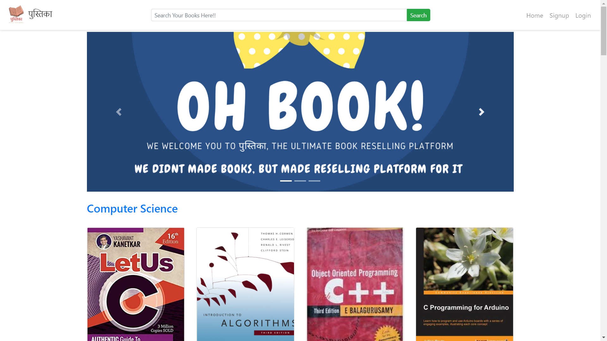
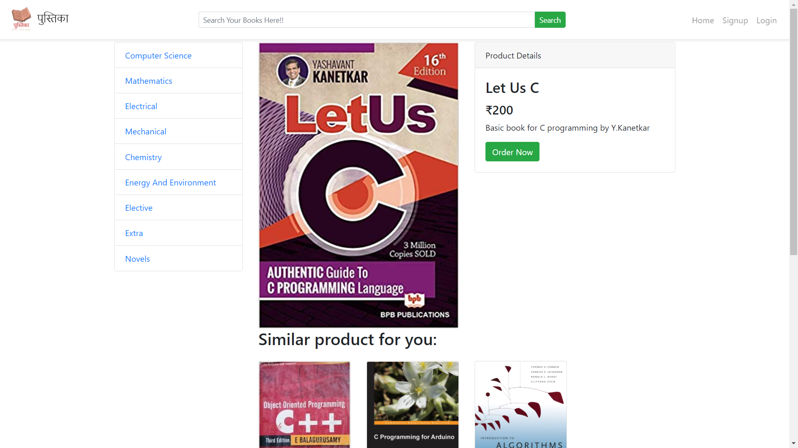

# पुस्तिका

[]()


पुस्तिका Is A Lightweight Bootstrap Made Majorly In Python, It Aims To Enable Students To Effectively Resell Their Old Books And Gives Them A Platform To Sell And Buy Several Good Books!!

  - Allow P2P Buy/Sell Of Book!
  - All Exchanges Must Be Done Physically, No Support For Online Transcations!
  - It Connects Book Readers Like You To Others In Need!

# New Features!

  - First Release
  - Added Several Books.
  - Sell/Buy Books At Cheap Rates.


पुस्तिका Tries To Implement A Book Selling Community Focused On Needs Of Students!

> The overriding design goal for पुस्तिका
> is to make a tool for students to enable them to resell their
> books effectively, without hassles to find other people to sell!
> It basically provides the community/platform for book sellers and
> buyers, so they can buy it without looking for suitable buyer!
> It cuts the process of finding people to buy and waste time.


### Installation

To install? first clone this repo then cd to cloned folder and install required module by this command:
```py
pip install -r requirements.txt
```

Afterwards we need a backend (ie mysql), you can install mysql server(i used wamp) in your pc and set Database username password in **app.py** file! Remember to import the tables from folder *database/* also!!

Now finally run the file app.py and **VOILA** you can see the site on localhost:5000! Enjoy the looks!!

### Demo
On Request Of Several People I am bringing photos of this website, So as to quench your thrust and know what we built!






### Todos

 - Flip card for more responsive design.
 - **Chat room for better communication.**
 - *Animation and general stuff (more responsive site)*
 - Pustika books verification system.


### What Has Been Done

 - Login/Register and account management with admin panel.
 - **Buy/Sell products using platform.**
 - *Added search bar to search for books!*
 - **You can place order for books giving your phone no and address.**


License
----

GPLv3

    Copyright (C) 2020 Kamalpreet Singh
    This program is free software: you can redistribute it and/or modify
    it under the terms of the GNU General Public License as published by
    the Free Software Foundation, either version 3 of the License, or
    (at your option) any later version.

    This program is distributed in the hope that it will be useful,
    but WITHOUT ANY WARRANTY; without even the implied warranty of
    MERCHANTABILITY or FITNESS FOR A PARTICULAR PURPOSE.  See the
    GNU General Public License for more details.

    You should have received a copy of the GNU General Public License
    along with this program.  If not, see <https://www.gnu.org/licenses/>.


**Free Software, Hell Yeah!**

[//]: # (These are reference links used in the body of this note and get stripped out when the markdown processor does its job. There is no need to format nicely because it shouldn't be seen. Thanks SO - http://stackoverflow.com/questions/4823468/store-comments-in-markdown-syntax)


   [dill]: <https://github.com/Kamalpreet-3223/r>
 
   [PlDb]: <https://github.com/joemccann/dillinger/tree/master/plugins/dropbox/README.md>
   [PlGh]: <https://github.com/joemccann/dillinger/tree/master/plugins/github/README.md>
   [PlGd]: <https://github.com/joemccann/dillinger/tree/master/plugins/googledrive/README.md>
   [PlOd]: <https://github.com/joemccann/dillinger/tree/master/plugins/onedrive/README.md>
   [PlMe]: <https://github.com/joemccann/dillinger/tree/master/plugins/medium/README.md>
   [PlGa]: <https://github.com/RahulHP/dillinger/blob/master/plugins/googleanalytics/README.md>
